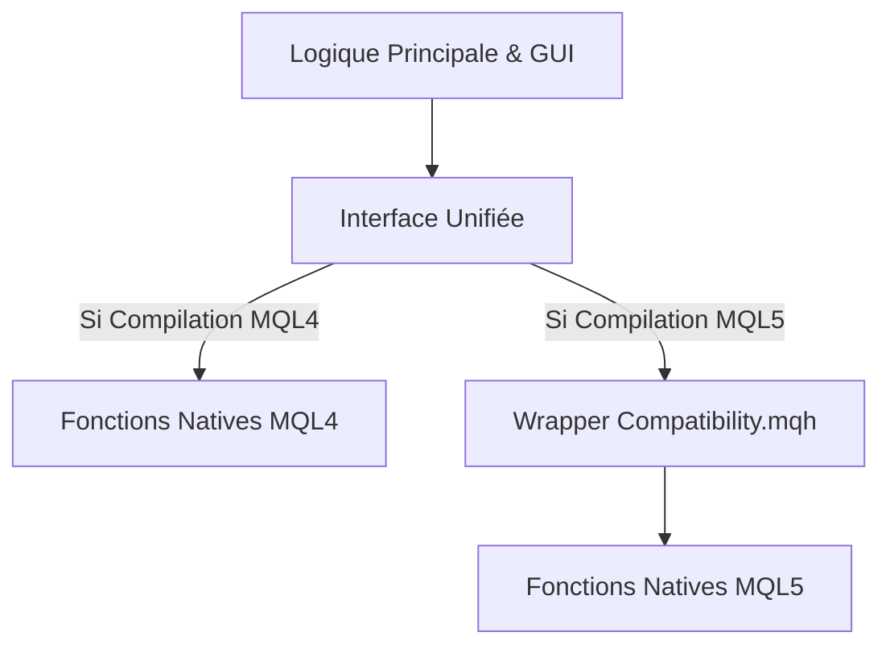

# FantomePad Project: Strategie de Migration MQL4 vers MQL5

Ce document détaille la feuille de route stratégique pour rendre l'Expert Advisor **FantomePad** compatible nativement avec **MetaTrader 5 (MQL5)** tout en conservant une base de code unique (Single Codebase).

## 🎯 Objectif
Avoir un seul projet capable de se compiler en `.ex4` (MT4) ou `.ex5` (MT5) sans duplication de code, garantissant une expérience utilisateur, une interface et des fonctionnalités 100% identiques.

---

## 🏗️ Stratégie : "Single Codebase, Dual Compile"

Au lieu de créer une copie séparée du projet (fork), nous allons introduire une **Couche de Compatibilité (Compatibility Layer)**.
Le code principal ne changera pas sa logique métier. Il appellera des fonctions "wrappées" qui agiront différemment selon la plateforme détectée lors de la compilation.

### Architecture Cible


---

## 🗺️ Feuille de Route Complète

### Phase 1 : Infrastructure de Compatibilité
**Objectif** : Permettre au compilateur MQL5 de lire le code sans erreur de syntaxe.

1.  **Création de `Create Compatibility.mqh`** :
    *   Fichier header à inclure au tout début du projet.
    *   Définition des constantes manquantes sous MQL5 (`OP_BUY`, `OP_SELL`, `MODE_ASK`, `Point`, etc.).
    *   Redéfinition des types simples (ex: `color`, `datetime` sont compatibles, mais vérifier les spécificités).

2.  **Standardisation des Séries Temporelles** :
    *   MQL4 accède directement aux tableaux `Open[]`, `Close[]`, `Time[]`.
    *   MQL5 requiert `CopyRates` ou `iOpen()`.
    *   **Action** : Remplacer tous les accès directs `Close[i]` par `iClose(Symbol(), Period(), i)`. Cette fonction existe sur les deux plateformes.

### Phase 2 : Abstraction des Données de Marché
**Objectif** : Unifier la récupération des informations (Prix, Spread, Stops levels).

1.  **Wrapper `MarketInfo`** :
    *   La fonction `MarketInfo(sym, type)` n'existe pas sous cette forme en MQL5.
    *   **Action** : Créer une fonction wrapper qui redirige vers `SymbolInfoDouble` ou `SymbolInfoInteger` si `#ifdef __MQL5__`.

2.  **Digits & Point** :
    *   S'assurer que `_Digits` et `_Point` sont utilisés correctement partout via l'abstraction.

### Phase 3 : Le Moteur de Trading (Cœur du Réacteur)
**Objectif** : Faire fonctionner l'exécution d'ordres sur les deux environnements.

1.  **Refonte de `Trade.mqh`** :
    *   Actuellement : Utilise `OrderSend` (syntaxe MQL4).
    *   **Action** : Modifier `SafeOrderSend` pour utiliser des préprocesseurs :
        ```cpp
        #ifdef __MQL5__
           // Préparer MqlTradeRequest / MqlTradeResult
           // Appeler OrderSend(request, result)
        #else
           // Code actuel MQL4
        #endif
        ```
    *   Gérer les différences de "Slippage" (Points sous MT4 vs Deviation sous MT5).

2.  **Système "Ordres vs Positions"** (Le plus gros défi technique) :
    *   MT4 : Tout est un "Ordre" (Market ou Pending).
    *   MT5 : "Position" (Market) est différent d'"Ordre" (Pending).
    *   **Action** : Créer une fonction unifiée `CountTrades()` et `GetTradeByIndex()` qui masque cette complexité pour que le GUI puisse juste demander "Combien de trades sont ouverts ?".

### Phase 4 : Interface Graphique (GUI)
**Objectif** : Rendu visuel identique à la virgule près.

1.  **Objets Graphiques** :
    *   La majorité des fonctions `ObjectCreate`, `ObjectSetInteger` sont compatibles à 99%.
    *   Vérifier les points d'ancrage (`ANCHOR`) et les Z-Orders qui peuvent varier légèrement.

2.  **Événements (`OnChartEvent`)** :
    *   Les signatures sont compatibles (`id`, `lparam`, `dparam`, `sparam`).
    *   Vérifier si les codes de touches (Key Codes) sont identiques (généralement oui).

### Phase 5 : Tests & Validation
1.  **Compilation Croisée** : Compiler régulièrement sur MetaEditor 4 et MetaEditor 5.
2.  **Test Unitaire** : Vérifier que `CalculateLotSize` donne le même résultat sur les deux.
3.  **Test Visuel** : Lancer PhantomPad sur MT5 et vérifier que le panneau s'affiche et réagit aux clics.

---

## 💡 Recommandations Finales

*   **Ne pas dupliquer** : Résiste à la tentation de copier-coller `fantomepad.mq4` en `fantomepad_mt5.mq4`. Garde un seul fichier maître.
*   **Commencer petit** : Fais d'abord compiler les `#include` avant de t'attaquer à la logique de trade.
*   **Utiliser `__MQL5__`** : C'est la macro magique qui te permet de séparer le code spécifique.

Cette feuille de route garantit une transition fluide et professionnelle, transformant **FantomePad** en un produit multi-plateforme robuste.
